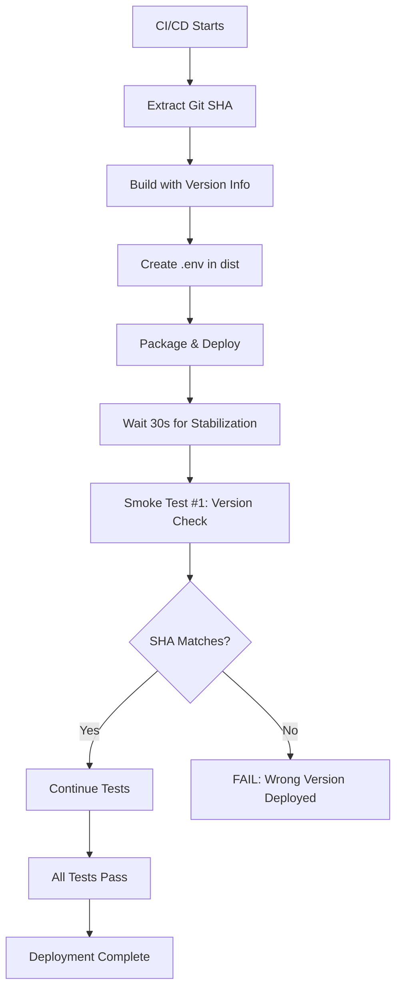

# Build Version Tracking

## Overview

The RFS Station Manager includes comprehensive build version tracking that allows easy verification of deployed code versions in production. This feature was implemented to address CI/CD deployment verification issues and provide instant visibility into which code version is running.

## Components

### 1. Frontend Version Tracking

**Implementation**: Version information is injected at build time via Vite configuration.

**Location**: `frontend/vite.config.ts`

**Display**: Landing page footer (`frontend/src/features/landing/LandingPage.tsx`)

**Information Shown**:
- Commit SHA (short form, e.g., `598f172`)
- Build timestamp with timezone
- Tooltip with full SHA on hover

**Example Display**:
```
Version 1.0 • Build: 598f172 • 1/4/2026, 10:47:42 AM
```

**TypeScript Types**: Defined in `frontend/src/vite-env.d.ts`

### 2. Backend Version Tracking

**Implementation**: Environment variables loaded from `.env` file in `backend/dist/` created during build process.

**Service**: `backend/src/services/version.ts` provides `getVersionInfo()` function

**Endpoints**: 
- `/health` - Health check with version info
- `/api/status` - Detailed status with version info

**Information Exposed**:
```json
{
  "version": {
    "commitSha": "598f1720f23b3375ef65484d60cc1a04f4d4df2d",
    "commitShort": "598f172",
    "buildTime": "2026-01-04T10:47:42.143Z",
    "nodeEnv": "production"
  }
}
```

**Environment Variables**:
- `GIT_COMMIT_SHA` - Full commit SHA from git
- `GIT_COMMIT_SHORT` - Short commit SHA (7 chars)
- `BUILD_TIMESTAMP` - ISO 8601 timestamp of build

### 3. CI/CD Integration

**Workflow File**: `.github/workflows/ci-cd.yml`

**Build Step**:
1. Extracts git commit SHA using `${{ github.sha }}`
2. Generates short SHA (first 7 characters)
3. Sets build timestamp from commit or current time
4. Injects variables during `npm run build`
5. Creates `.env` file in `backend/dist/` with version info
6. Packages everything for deployment

**Post-Deployment Testing**:
- First smoke test verifies deployed commit SHA matches expected SHA
- Receives `GITHUB_SHA` environment variable from workflow
- Compares against version returned by `/health` endpoint
- Fails deployment if mismatch detected

## Deployment Verification Workflow



## Benefits

### 1. Instant Verification
- Navigate to landing page and check footer
- No need to SSH into server or check logs
- Visible to all users and developers

### 2. Automated Safety Check
- First smoke test catches deployment mismatches immediately
- Prevents old code from running undetected
- Clear error messages guide troubleshooting

### 3. Debugging Aid
- Quickly identify which version is running when investigating issues
- Correlate bug reports with specific commits
- Verify fixes are deployed

### 4. Audit Trail
- Build timestamps provide deployment history
- Can track when each version was deployed
- Helps with rollback decisions

### 5. Robust Handling
- Works with push, PR, and manual workflow triggers
- Falls back to current time if commit timestamp unavailable
- Gracefully handles missing or invalid version data

## Usage

### Check Version in Production UI

1. Navigate to the application landing page
2. Scroll to the footer at the bottom
3. Look for version info: `Version 1.0 • Build: abc1234 • 1/4/2026, 10:47 AM`
4. Hover over timestamp to see full SHA and ISO timestamp in tooltip

### Check Version via API

**Health Endpoint**:
```bash
curl https://bungrfsstation.azurewebsites.net/health | jq .version
```

**Status Endpoint**:
```bash
curl https://bungrfsstation.azurewebsites.net/api/status | jq .version
```

**Expected Response**:
```json
{
  "commitSha": "598f1720f23b3375ef65484d60cc1a04f4d4df2d",
  "commitShort": "598f172",
  "buildTime": "2026-01-04T10:47:42.143Z",
  "nodeEnv": "production"
}
```

### Run Version Verification Test

**Locally** (testing against deployed app):
```bash
cd backend
GITHUB_SHA=<expected-commit-sha> \
APP_URL=https://bungrfsstation.azurewebsites.net \
npm run test:post-deploy
```

**In CI/CD**:
Automatic - GITHUB_SHA is injected by workflow and tests run automatically after deployment.

### Compare Local vs Deployed Version

**Get local commit**:
```bash
git rev-parse HEAD
```

**Get deployed version**:
```bash
curl https://bungrfsstation.azurewebsites.net/health | jq -r .version.commitSha
```

**Compare**:
```bash
LOCAL=$(git rev-parse HEAD)
DEPLOYED=$(curl -s https://bungrfsstation.azurewebsites.net/health | jq -r .version.commitSha)
if [ "$LOCAL" = "$DEPLOYED" ]; then
  echo "✅ Deployed version matches local"
else
  echo "❌ Version mismatch: Local=$LOCAL, Deployed=$DEPLOYED"
fi
```

## Files Modified

### Core Implementation
- `frontend/vite.config.ts` - Inject version at build time using git commands
- `frontend/src/vite-env.d.ts` - TypeScript declarations for `__APP_VERSION__`
- `frontend/src/features/landing/LandingPage.tsx` - Display version in footer
- `backend/src/services/version.ts` - Version utility functions for backend
- `backend/src/index.ts` - Expose version in `/health` and `/api/status` endpoints

### CI/CD Integration
- `.github/workflows/ci-cd.yml` - Inject version during build, create .env file
- `backend/src/scripts/postDeploymentTests.ts` - Version verification smoke test

### Build Configuration
- `backend/tsconfig.json` - Exclude test files and mocks from production build

## Troubleshooting

### Version Shows "unknown"

**Cause**: Version environment variables not set during build or runtime.

**Frontend Fix**:
- Ensure git repository is available during build
- Check Vite build output for errors
- Verify `vite.config.ts` is executing git commands successfully

**Backend Fix**:
- Check `.env` file exists in `backend/dist/` after build
- Verify environment variables are loaded in production
- Check `backend/src/index.ts` loads `.env` from dist directory

### Version Mismatch in Smoke Tests

**Cause**: Deployed code doesn't match expected commit SHA.

**Possible Reasons**:
1. Build artifact not properly created
2. Old deployment artifacts cached
3. Azure deployment didn't pick up new files
4. Build failed but old code still running

**Resolution**:
1. Check CI/CD build logs for errors
2. Verify `backend/dist/.env` was created during build
3. Check Azure App Service deployment logs
4. Try manual deployment or restart App Service
5. Verify `.deployment` file points to correct directory

### Timestamp Shows "Invalid Date"

**Cause**: Build timestamp is invalid or missing.

**Fix Applied**: Frontend now conditionally renders timestamp only if valid.

**Verify Fix**:
```bash
cd frontend
npm run build
grep -r "buildTime" dist/assets/*.js
```

### Manual Workflow Trigger Has No Timestamp

**Cause**: `github.event.head_commit.timestamp` is null for manual triggers.

**Fix Applied**: CI/CD now falls back to `github.event.repository.updated_at` or current time.

**Verify Fix**:
- Manually trigger workflow from GitHub Actions UI
- Check build step logs for timestamp value
- Verify deployed version has valid timestamp

## Future Enhancements

### Potential Additions
1. **Branch Name**: Show current branch in version info
2. **Last Deploy Time**: Separate from build time, shows actual deployment timestamp
3. **Deployer Info**: Who triggered the deployment
4. **Version Comparison**: Show diff between current and previous versions
5. **Admin Dashboard**: Dedicated page with detailed version history
6. **API Versioning**: Semantic versioning for API endpoints
7. **Rollback Info**: Link to previous version for easy rollback
8. **Build Duration**: How long the build took
9. **Environment Badge**: Visual indicator of environment (prod/staging/dev)

### Implementation Priority
- **High**: Admin dashboard with version history
- **Medium**: Branch name and deployer info
- **Low**: Build duration and diff comparison

## Security Considerations

### What's Exposed
- Git commit SHA (public information)
- Build timestamp (non-sensitive)
- Node environment name (development/production)

### What's NOT Exposed
- Environment variables or secrets
- Database connection strings
- API keys or credentials
- Internal system details

### Risk Assessment
**Low Risk**: Version information is read-only and doesn't expose sensitive data. Commit SHAs are already public in GitHub repository.

### Best Practices
- ✅ Version endpoint is unauthenticated (safe for monitoring)
- ✅ No sensitive data in version object
- ✅ Can't be used to manipulate system state
- ✅ Useful for security audits (know what's deployed)

## Maintenance

### Updating Version Format

**Change Display Format**:
Edit `frontend/src/features/landing/LandingPage.tsx` footer section.

**Change Version Object Structure**:
1. Update `frontend/src/vite-env.d.ts` (TypeScript types)
2. Update `frontend/vite.config.ts` (build-time injection)
3. Update `backend/src/services/version.ts` (backend interface)
4. Update `.github/workflows/ci-cd.yml` (environment variables)

### Adding New Version Fields

Example: Adding branch name

**1. Update Frontend Types**:
```typescript
// frontend/src/vite-env.d.ts
interface AppVersion {
  commitSha: string;
  commitShort: string;
  buildTime: string;
  nodeEnv: string;
  branchName: string; // NEW
}
```

**2. Update Vite Config**:
```typescript
// frontend/vite.config.ts
const getBranchName = () => {
  try {
    return execSync('git rev-parse --abbrev-ref HEAD').toString().trim()
  } catch {
    return 'unknown'
  }
}

define: {
  '__APP_VERSION__': JSON.stringify({
    // ... existing fields ...
    branchName: getBranchName(), // NEW
  }),
}
```

**3. Update Backend Service**:
```typescript
// backend/src/services/version.ts
export interface VersionInfo {
  // ... existing fields ...
  branchName: string; // NEW
}

export function getVersionInfo(): VersionInfo {
  return {
    // ... existing fields ...
    branchName: process.env.GIT_BRANCH_NAME || 'unknown', // NEW
  };
}
```

**4. Update CI/CD Workflow**:
```yaml
# .github/workflows/ci-cd.yml
- name: Build application
  env:
    # ... existing env vars ...
    GIT_BRANCH_NAME: ${{ github.ref_name }}
  run: |
    # ... existing commands ...
    echo "GIT_BRANCH_NAME=${{ github.ref_name }}" >> backend/dist/.env
```

### Testing Version Changes

**1. Test Local Build**:
```bash
# Build both frontend and backend
npm run build

# Check frontend has version
grep -r "commitSha" frontend/dist/assets/*.js

# Check backend has version
cat backend/dist/.env
```

**2. Test Backend Version Endpoint**:
```bash
# Start backend
cd backend
node dist/index.js &
sleep 3

# Query version
curl http://localhost:3000/health | jq .version

# Stop backend
kill %1
```

**3. Test in CI/CD**:
- Push changes to branch
- Observe CI/CD workflow build step
- Check post-deployment test output
- Verify version appears in production

## Support

For issues or questions about version tracking:
1. Check this documentation first
2. Review CI/CD build logs
3. Check Azure App Service logs
4. Open an issue in the repository with:
   - Expected vs actual version
   - Screenshots of UI or API responses
   - Relevant log excerpts

---

**Last Updated**: January 4, 2026  
**Version**: 1.0  
**Author**: RFS Station Manager Development Team
