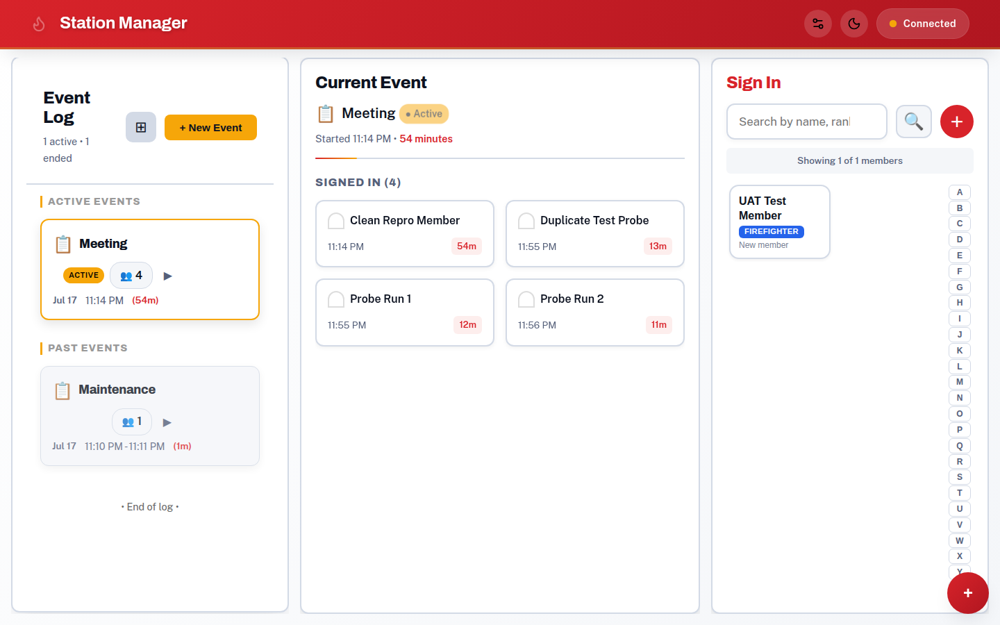

# Station Manager — User Guide

Welcome! This guide covers everything you can do with RFS Station Manager,
written in plain language for brigade members, kiosk operators, and
administrators. No jargon, no assumed tech knowledge.

## What is Station Manager?

Station Manager is a digital sign-in book and station toolkit for Rural Fire
Service brigades. Members sign in and out on a shared tablet (or their own
phone), track what they're working on, run truck checks, and see reports —
and everything updates live on every screen at the station.

It's part of the **Bushie Tools** suite, which also includes **AAR Studio**
(AI-assisted After Action Reviews).

## Guide contents

### Everyday use

| Page | What it covers |
|---|---|
| [Getting started](getting-started.md) | Creating an account, plans, logging in, trying the demo |
| [Sign-in book](sign-in.md) | Checking in and out, activities, events |
| [Profiles & achievements](profiles-and-achievements.md) | Your member profile, QR code, stats, and the achievement system |
| [Truck checks](truck-checks.md) | Running a vehicle check, recording issues, joining a check in progress |
| [Voice check](voice-check.md) | Doing a truck check hands-free by talking to the assistant (AI Pro plan) |
| [Reports](reports.md) | Attendance and compliance reports, cross-station views, CSV export |
| [AAR Studio](aar-studio.md) | Running an After Action Review (AI Pro plan) |

### Setting up and running a station

| Page | What it covers |
|---|---|
| [Administrator guide](admin-guide.md) | Stations, kiosk access tokens, your organisation, plans and billing, inviting members |
| [Kiosk & app installation](kiosk-and-pwa.md) | Setting up the station tablet, installing the app on a phone, offline behaviour |
| [Linking from your brigade website](brigade-website-linking.md) | Giving your brigade one-tap access from your own site |

### Reference

| Page | What it covers |
|---|---|
| [Achievements list](achievements.md) | All 20 achievements and how to earn them |
| [Keyboard shortcuts](keyboard-shortcuts.md) | Full keyboard navigation reference |
| [Screen reader guide](screen-reader-guide.md) | Using Station Manager with a screen reader |
| [Troubleshooting](troubleshooting.md) | Common problems and what to do about them |

## Plans at a glance

What you can use depends on your brigade's plan:

| | Community (free) | Basic | AI Pro |
|---|---|---|---|
| Sign-in book, events, profiles | ✅ (up to 10 members) | ✅ unlimited | ✅ unlimited |
| Truck checks | ✅ (1 vehicle) | ✅ unlimited | ✅ unlimited |
| Reports & CSV export | — | ✅ | ✅ |
| Multiple stations | — | ✅ | ✅ |
| AAR Studio (AI reviews) | — | — | ✅ |
| Voice check assistant | — | — | ✅ |

If a card on the home screen shows **"Not in your plan"**, your organisation's
owner can upgrade from **Admin → Organization** — see the
[administrator guide](admin-guide.md).
