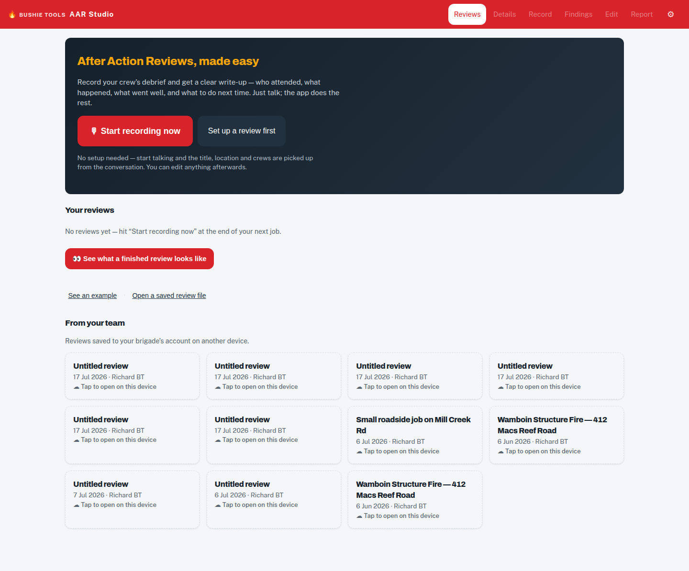
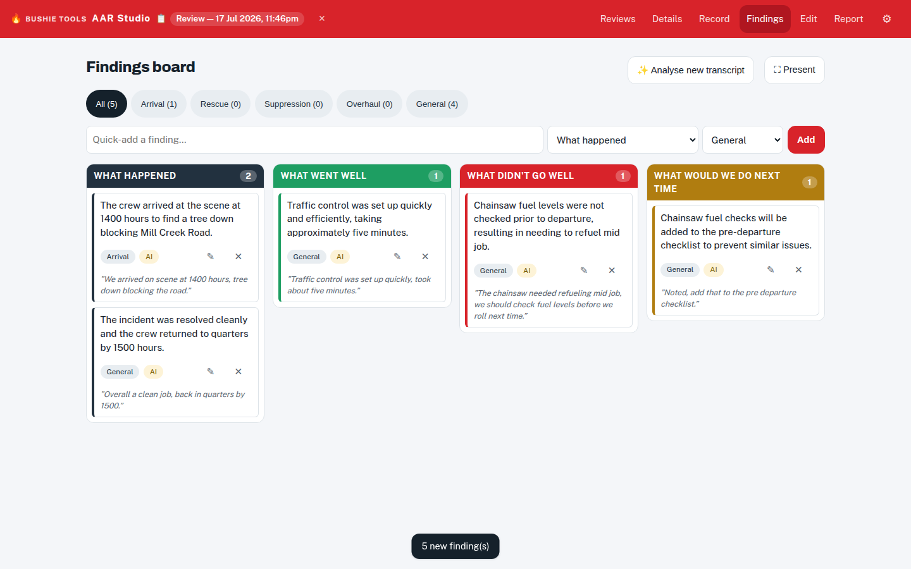
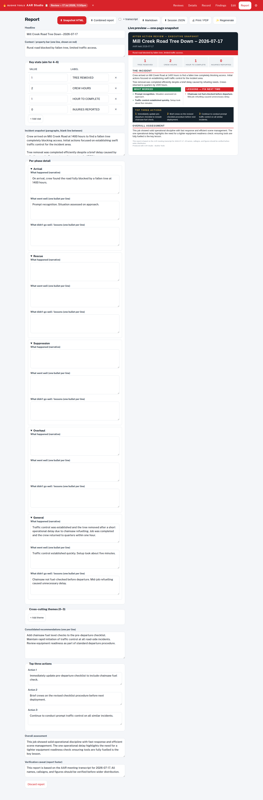

# AAR Studio — After Action Reviews

*Requires the AI Pro plan.*

AAR Studio helps a facilitator run an **After Action Review** — the structured
debrief after an incident, exercise, or event — and turns the discussion into
a presentable findings board and a shareable report. The AI does the
note-taking so the room can do the talking.

Open it from the **AAR Studio** card on the home screen (it lives at `/aar`).
Want to see it in action first? Use the **"See an example"** button (or an
`/aar/?demo` link) to load a worked example review.

## Running a review

1. **Set up** — describe the review: what it's about, where, when, who's
   facilitating, and which units attended. If you're signed in, the location
   and facilitator fields autocomplete from your brigade's stations and
   roster.
2. **Capture the discussion** — two ways, use either or both:
   - **Live transcription** — AAR Studio listens to the room and transcribes
     as people speak.
   - **Room notes** — tap **Host session** to get a short join code and link.
     Anyone in the room opens it on their phone (no account needed) and types
     observations that flow onto your board live.
3. **Analyse** — the AI reads the transcript and notes and extracts
   **findings**: what went well, what didn't, and recommendations — each
   linked back to the supporting quote. Possible duplicate findings are
   flagged with one-tap **Merge / Keep both** choices.

4. **Refine the board** — edit findings, add your own, categorise them, and
   attribute findings to a specific unit where relevant.
5. **Report** — generate a formatted review report (with a findings register)
   to present, print, or file.

## Where your reviews live

- Reviews are saved **on your device** as you work — AAR Studio is fully
  usable offline/signed-out for capture and boards (only the AI analysis
  needs a connection and an AI Pro sign-in).
- When you're signed in, reviews also **back up to your brigade's cloud**
  automatically. Teammates see them in a **"From your team"** section on
  their own device and can pull one down with a tap.
- If two people edit the same review, the newer version is flagged
  ("☁ Newer version from your team") rather than silently overwritten —
  choose **Load latest** to take it.

## AI usage allowance

AI analysis is metered: the AI Pro plan includes a monthly allowance of AI
sessions (about 25). The **Admin → Organization** page shows a usage meter,
and owners can buy a top-up pack if the brigade runs out mid-month. You'll get
a clear message (rather than a silent failure) if the allowance is exhausted.
