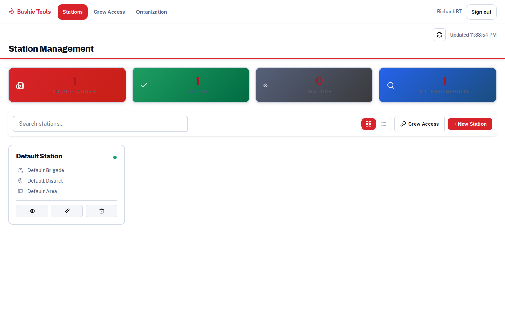
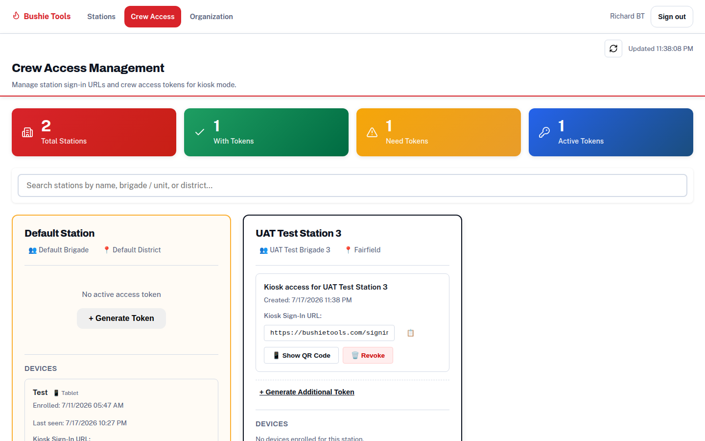
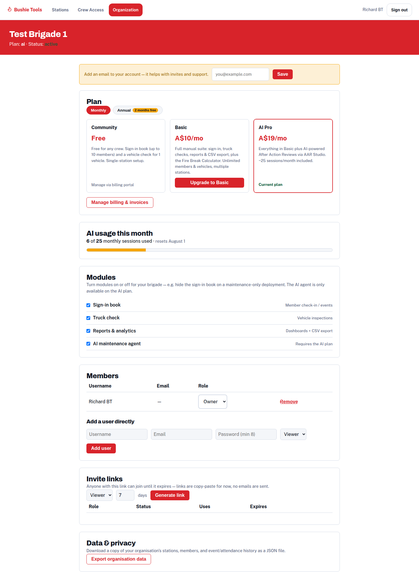

# Administrator Guide

For the person (or people) who run Station Manager for the brigade. Admin
pages are under the profile menu when you're logged in: **Stations**, **Brigade
Access**, and **Organization**.

## Roles

| Role | Who | Can do |
|---|---|---|
| **Owner** | Whoever claimed/created the organisation | Everything — plan, billing, users, plus all admin abilities |
| **Admin** | Trusted brigade officers | Manage stations, members, vehicles, brigade access, resolve issues |
| **Viewer** | Invited members | View their profile and brigade data; no management actions |
| **Kiosk** | The station tablet (via brigade access token) | Sign-in book and truck-check actions — no admin pages |

Roles are per-organisation — if you belong to more than one (see
[Inviting members & multiple organisations](getting-started.md#inviting-members--multiple-organisations)),
you can hold a different role in each, and a switcher next to your username
lets you pick which one you're working in.

## Stations (`Admin → Stations`)

An organisation can run one or more **stations** (Basic plan and above for
multiples; a plan-limit message appears if you hit your ceiling).

- **Create a station** — search the built-in national RFS facilities list to
  pick your station (it fills in the details) or create one manually. The
  search prevents duplicate creation.
- **Switch station** — the station selector controls which station's book,
  vehicles, and reports you're looking at.
- Every station's data is isolated — brigades never see each other's members,
  checks, or reports.

## Brigade access — setting up kiosks (`Admin → Brigade Access`)

A **brigade access token** is what lets the shared station tablet use the
sign-in book without anyone logging in.

1. Create a token for your station (give it a sensible name, e.g. "Engine bay
   iPad").
2. Open the generated link on the tablet — the tablet is now linked to your
   station in kiosk mode.
3. Revoke a token any time (lost tablet, retired device); the tablet loses
   access immediately.

Tokens are long random codes — practically unguessable — and only unlock the
day-to-day pages (sign-in, truck checks), never the admin pages. For putting a
sign-in link on your brigade's website, see
[linking from your brigade website](brigade-website-linking.md).

## Organization, plans & billing (`Admin → Organization`)

The owner's page for the business side:

- **Plan** — see your current plan and upgrade/downgrade. Paid plans start
  with a **14-day trial** and are billed through Stripe (card details are
  entered on Stripe's secure checkout — Station Manager never sees them).
  **Manage billing** opens the Stripe customer portal for invoices, card
  changes, and cancellation.
- **Modules** — toggle features on or off for your organisation (e.g. a
  maintenance-only brigade can turn the sign-in book off). Toggles above your
  plan's ceiling are rejected with a clear message.
- **Branding** — set your agency's real name and a logo URL (defaults from the
  facility you picked at signup, e.g. "SES" or "Rural / country fire" — you
  can always override it here). Shown on exported PDF reports instead of the
  generic "Station Manager" name, since the platform serves rural/metro fire,
  SES, ambulance, and police brigades, not just one agency.
- **Members** — list of everyone in the organisation with their role; owners
  and admins can change roles or remove someone (an organisation always keeps
  at least one owner). You can also create a login directly with a username
  and password.
- **Invite links** — generate a shareable link (role + expiry) instead of
  creating logins one by one — see
  [Inviting members & multiple organisations](getting-started.md#inviting-members--multiple-organisations).
- **AI usage meter** (AI Pro) — sessions used this month, your included
  allowance, and any bonus sessions. When you're low or out, a **"Buy more
  sessions"** button purchases a one-time top-up pack (bonus sessions don't
  expire monthly).

## Members

Member management happens where the members are:

- **Add members** on the sign-in page, or **import a CSV** for first setup —
  column headers are matched flexibly (e.g. "First Name", "firstname", and
  "given name" all work), and the preview shows which columns it recognised
  before you confirm.
- **Invite a member to their own login** from their profile — they receive a
  one-time activation link and set a password (viewer role).
- Community plan allows up to 10 members; Basic/AI Pro are unlimited. Limit
  errors include an upgrade link.

## Vehicles & checks

Vehicle and checklist administration is covered in the
[truck checks guide](truck-checks.md#setting-up-vehicles-admins): vehicles and
identity details, vehicle types with locked standard checklists, per-vehicle
custom items, zones & equipment for the voice assistant, the history tab, and
the issue **Follow-ups** workflow.

## Housekeeping tips

- **Check the Follow-ups tab weekly** — it's the list of everything a truck
  check has flagged that nobody has resolved yet.
- **Use reports monthly** — the attendance summary is built for brigade
  meetings; CSV export feeds anything else.
- **Keep one owner spare** — create a second owner login so the brigade isn't
  locked out if someone moves on.
