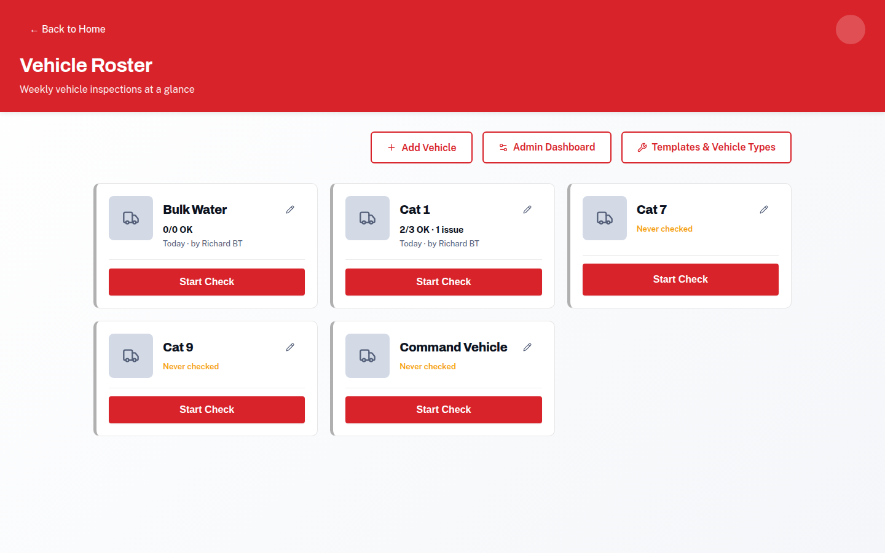
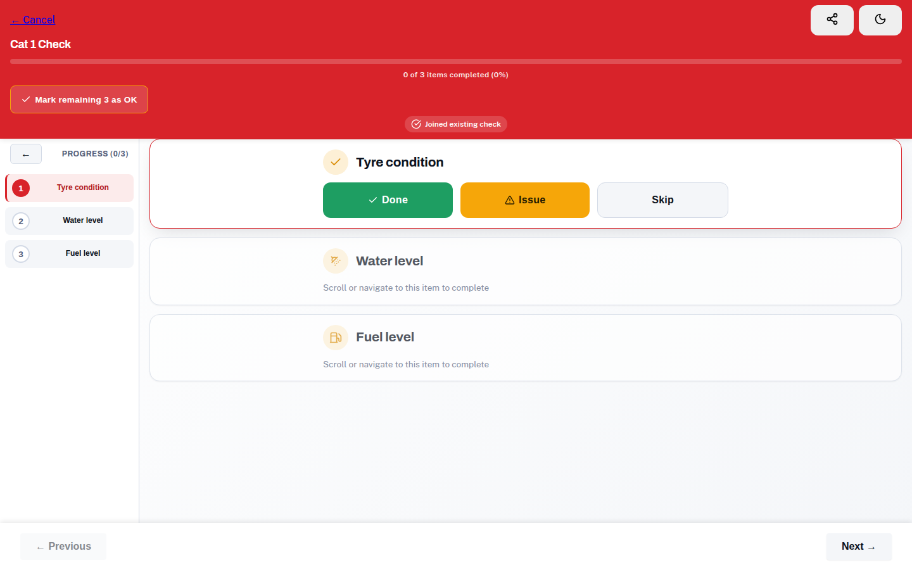
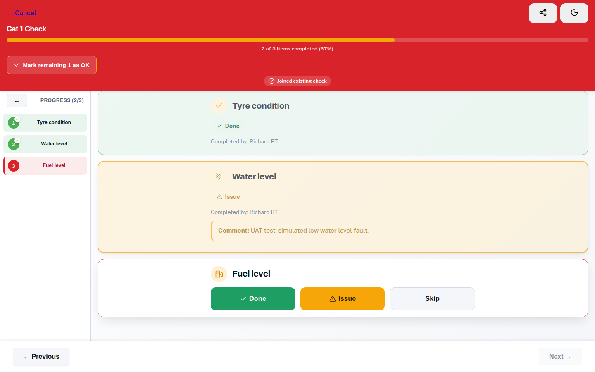
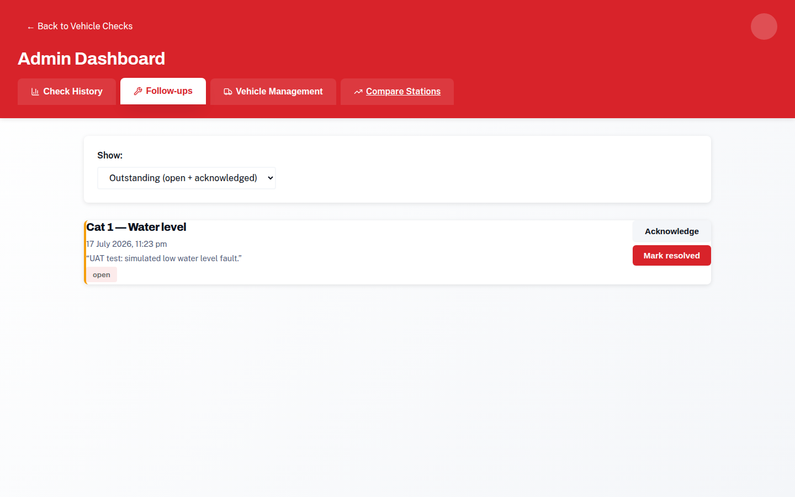
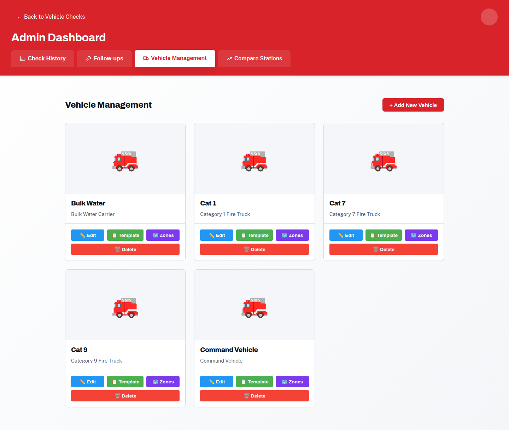
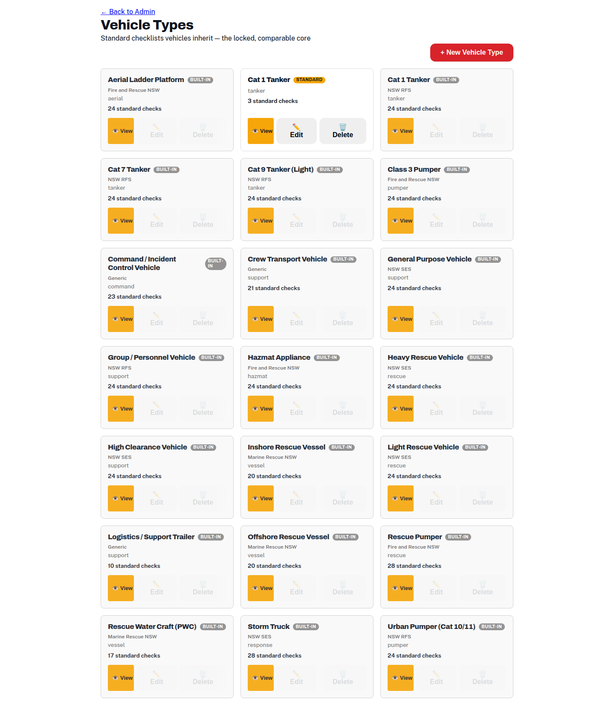
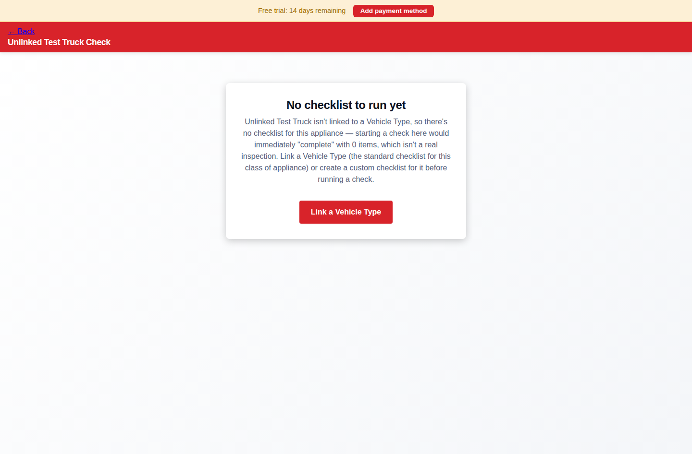

# Truck Checks

Truck checks replace the paper checklist on the clipboard. Every vehicle gets
a checklist based on its **vehicle type** (a Cat 1 tanker gets the standard
Cat 1 items), your brigade can add its own extra items, and every result is
recorded against the vehicle's history — with issues tracked until they're
fixed.

## Running a check

1. Open **Vehicle Check** from the home screen. You'll see a card for each of
   your brigade's vehicles, with a "Last checked" note so overdue trucks stand
   out. A red **⚠ Open issues** badge means something recorded earlier still
   needs attention.

2. Tap the vehicle, then **Start check**.
3. **Say who you are** — start typing your name and pick yourself from the
   member list (or just type a name if you're not on the roster). The check is
   recorded against you.
4. Work through the checklist. Items are grouped by section, in walk-around
   order. For each item choose:
   - **Done** — all good. Some items ask for a reading (tyre pressure, fuel
     level) — type or pick the value.
   - **Issue** — something's wrong. Add a short note describing it ("left rear
     tyre worn on the outside edge").
   - **Skip** — couldn't check it this time.
5. **Mark remaining as OK** is a fast-path button that completes every
   untouched item in one tap (anything you flagged as an issue is left alone) —
   paper-clipboard speed for a truck that's all good.
6. Finish the check. The **summary page** shows what was recorded and any
   issues raised.

### Joining a check someone else started

If a crewmate already started today's check, opening the same vehicle **joins**
their check rather than starting a second one. You'll land on the first item
nobody has done yet, and both your names are recorded as contributors. (The
[voice assistant](voice-check.md) joins an in-progress check the same way.)

## Issues and follow-ups

Recording an **Issue** doesn't just note it — it opens a follow-up that stays
visible until someone deals with it:

- Issues appear on the vehicle's card (⚠ badge), in the check summary, and in
  the admin dashboard's **Follow-ups** tab.
- From Follow-ups, an admin can **acknowledge** an issue, **assign** it to
  someone, and **resolve** it with a note about what was done.
- The full lifecycle (open → acknowledged → resolved, who and when) is kept on
  the record.

## Setting up vehicles (admins)

From the Vehicle Check admin dashboard:

- **Add a vehicle** with its identity details — fleet/agency number, rego,
  make, model, year — and link it to a **vehicle type**.

- **Vehicle types** (`Vehicle Types` page) carry the *standard checklist* for
  that class of truck. Standard items are locked — every brigade using the
  type checks the same core items, which is what makes results comparable
  across brigades. Your brigade can **add its own items and reorder**, but
  can't remove the standard ones.

A vehicle with no linked type has no checklist yet — starting a check on one
shows a guidance screen instead of letting the check run against nothing:

- **Zones & equipment** — optionally describe the truck's physical layout
  (walk-around zones like "front", "driver side rear locker") and the
  equipment carried in each. Zones can be seeded automatically from the
  vehicle type. This powers the [voice assistant](voice-check.md)'s
  area-by-area guidance, and quirks notes ("rear hatch sticks in the cold")
  teach it your specific truck.
- **Templates** — a per-vehicle checklist overlay for anything unique to that
  one truck.

On the Community plan a brigade has one vehicle; Basic and AI Pro are
unlimited.

## Check history (admins)

The admin dashboard's **History** tab lists every run: who did it, when, and
the outcome. In-progress runs are badged **"In progress — started by …"** so an
abandoned check never masquerades as a completed one. Results can be exported
to CSV — see [Reports](reports.md).
